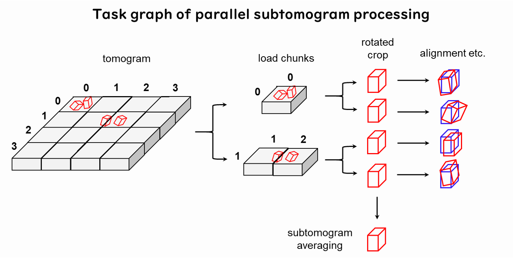

# acryo

An extensible cryo-EM/ET toolkit for Python.
The purpose of this library is to make data analysis on cryo-EM/ET more safe, efficient and reproducible.
Currently only the subtomogram averaging part is implemented.

[📘 Documentation](https://hanjinliu.github.io/acryo/)

### Install

```bash
pip install acryo -U
```

### Highlights

1. Out-of-core and parallel processing by `SubtomogramLoader`. It uses
   [dask](https://github.com/dask/dask) to make full use of CPU.
   
2. Alignment algorithms are highly extensible by inheriting `BaseAlignmentModel` for the most
   low-level implementation or `TomographyInput` for extension at more practical-level. You
   can customize pre-processing, alignment function and easily extend it to support multi-
   reference alignment.
3. Concise representation of subtomograms, using `numpy.ndarray` for positions and
   `scipy.spatial.transform.Rotation` for orientation.
4. Tomogram simulation using `TomogramSimulator`.
5. Masked PCA clustering.
