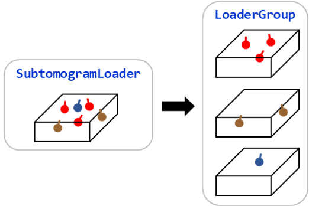

============
Loader Group
============

The :meth:`groupby` of subtomogram loaders returns a :class:`LoaderGroup` object.
An :class:`LoaderGroup` object is very similar to those returned by :meth:`groupby`
methods of :class:`polars.DataFrame`, :class:`Molecules` or :class:`pandas.DataFrame`.

.. code-block:: python

    from acryo import SubtomogramLoader

    loader = SubtomogramLoader(image, molecules)
    for cluster, ldr in loader.groupby("cluster_id"):
        assert (out.molecules.features["cluster_id"] == cluster).all()

:class:`LoaderGroup` has many methods of the same name as those in :class:`SubtomogramLoader`.

Group-wise Averaging
====================

:class:`LoaderGroup` supports all the averaging methods.

- :meth:`average`
- :meth:`average_split`

In :class:`LoaderGroup` version, result is returned as a ``dict``
of group key and the averages.

Group-wise Alignment
====================

:class:`LoaderGroup` also supports all the alignment methods

- :meth:`align`
- :meth:`align_no_template`
- :meth:`align_multi_templates`

In :class:`LoaderGroup` version, result is returned as an updated :class:`LoaderGroup`.

If you want to collect aligned :class:`Molecules` objects, following codes are
essentially equivalent.

.. code-block:: python

    # call align() for each loader
    aligned = []
    for cluster, ldr in loader.groupby("cluster_id"):
        out = ldr.align(template)
        aligned.append(out.molecules)

    # call align() of the LoaderGroup object.
    aligned = []
    for cluster, ldr in loader.groupby("cluster_id").align(template):
        aligned.append(out.molecules)

Since each group does not necessarily composed of the same molecules, you can use a mapping
of templates for alignment functions.

.. code-block:: python

    templates = {
        0: template0,
        1: template1,
        2: template2,
    }
    aligned = loader.groupby("cluster_id").align_multi_templates(templates)
